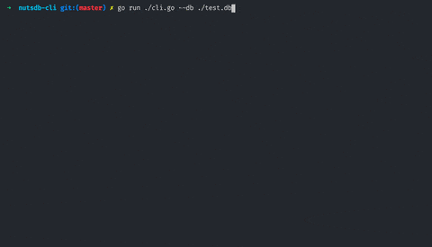

# nutsdb-cli
A CLI tool for NutsDB https://github.com/xujiajun/nutsdb

Say, you have a database, and want to inspect it like with sql tools. This tool will help with review of buckets and keys.

# Install

```shell
go install github.com/av-elier/nutsdb-cli
```

# Usage


